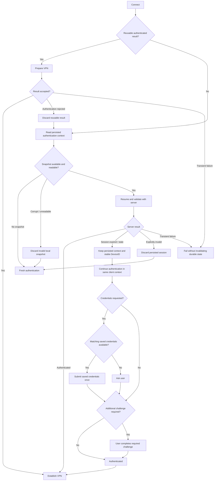

# Authentication recovery semantics

This document defines the long-term semantics of authentication persistence, reuse, recovery, and invalidation.

It is authoritative for **what authentication state survives, how connection attempts reuse it, and when it is invalidated**.

Related documents have narrower responsibilities:

* [architecture.md](architecture.md) defines Android ownership, lifecycle, `VpnService`, connection state, and network recovery.
* [gomobile-bridge.md](gomobile-bridge.md) defines the Kotlin–Go API, generated AAR, callback contract, and reproducible build boundary.

Implementation details may change without changing the semantics defined here.

## Purpose

A normal connection should reuse the strongest authentication state that is still valid instead of treating every Connect action as a fresh login.

The core invariants are:

* ordinary disconnect is not logout;
* Activity or ViewModel recreation is not logout;
* process death and device reboot should recover from encrypted persisted state when possible;
* an expired session is not necessarily an invalid client context;
* transient network, DNS, TLS, and protocol failures do not invalidate durable authentication state;
* saved credentials may assist foreground reauthentication but never bypass a server-required challenge;
* account switch is the explicit boundary that removes the previous account's authentication state.

The user-facing result should normally remain a one-tap connection even when several recovery steps happen internally.

## Authentication state layers

Authentication state is deliberately split into independent layers.

### Reusable authenticated result

After successful authentication, the Go core retains a complete authenticated result in process memory.

It can be used directly for VPN preparation without repeating authentication.

Properties:

* process-local only;
* survives ordinary VPN disconnect;
* survives cancellation of a separate interactive authentication flow;
* disappears naturally when the process dies;
* is discarded when the server definitively rejects it or when the user switches account.

It is always the first choice for a foreground Connect while available.

### Persisted authentication context

Android stores an encrypted recovery snapshot in `noBackupFilesDir`.

The snapshot contains the minimum client/session context required to resume authentication. It is not treated as proof that the user is still authenticated: every restore is validated with the server.

Properties:

* survives process death and device reboot;
* is encrypted with an Android Keystore-backed key;
* is validated before being trusted;
* remains useful when the current session is merely stale;
* is deleted only when it is locally unreadable or definitively invalid.

An expired cookie or session therefore does not automatically destroy the persisted client context.

### Saved credentials

Saved username/password credentials are a separate recovery asset.

They use their own encrypted store and Keystore key rather than sharing storage with the authentication snapshot.

Properties:

* written only after successful authentication;
* used automatically at most once during a foreground recovery attempt;
* used only when the remembered account is empty or matches them;
* never read or submitted by background Always-on or Quick Settings recovery;
* removed when the server explicitly rejects them.

Saved credentials assist reauthentication. They do not replace session recovery and do not bypass CAPTCHA, SMS, TOTP, phone selection, or other server-required challenges.

### Stable device identity

The Android client maintains a stable app-scoped aTrust DeviceID.

The same identity is used for fresh authentication, session resume, and stale-session reauthentication. Session expiry does not create a new identity.

Account switch clears account-specific authentication state but does not require creating a new device identity.

### Interactive challenge state

Password prompts, phone selection, SMS codes, TOTP/token input, CAPTCHA state, and similar server challenges belong only to the current authentication flow.

They are not durable authentication assets and are not persisted for later recovery.

## Recovery ladder

A foreground Connect follows one recovery ladder rather than several independent login flows:

```text
reusable authenticated result
        ↓
persisted authentication context
        ↓
continue authentication in the restored client context
        ↓
saved credentials, when requested
        ↓
server-required interactive challenge
        ↓
fresh authentication when no usable persisted context exists
```

The main flow is:



A failure in one layer should invalidate only the state proven unusable at that layer.

## Session semantics

### Authenticated

Successful authentication produces a reusable in-memory result and refreshes the encrypted recovery snapshot.

A successful foreground credential login may also refresh saved credentials.

### Session expired

`sessionExpired` means that the current session can no longer directly prove authentication.

It does **not** mean that the persisted client context is invalid.

The invariant is:

```text
sessionExpired != invalidSession
```

Foreground recovery keeps the existing persisted context and stable DeviceID and continues authentication in the same client context. If the server requests credentials, matching saved credentials may be submitted once. Any further server challenge is completed by the user.

### Invalid session

`sessionInvalid` or `invalidSession` means that the persisted authentication context has been definitively rejected.

The persisted snapshot is deleted and the client falls back to fresh authentication.

This does not by itself delete saved credentials.

### Reusable result rejected

An in-memory authenticated result may later be rejected during VPN preparation.

Only an authentication/server rejection invalidates that reusable result and triggers fallback to the persisted recovery path.

Timeouts, network unavailability, TLS failures, and other transient failures do not destroy the reusable or persisted authentication state.

### Credentials rejected

`credentialsRejected` invalidates the saved password.

The saved credential is deleted and the foreground flow waits for new user input. The persisted client context is not discarded merely because the saved password was wrong.

### Transient failure

Network, DNS, TLS, timeout, and similar operational failures are not authentication invalidation.

Durable session and credential state is retained for a later retry.

### Cancellation and disconnect

Cancelling an in-progress authentication attempt stops that attempt but is not logout.

Ordinary VPN disconnect similarly ends the VPN lifecycle without clearing authentication state.

### Account switch

Account switch is the explicit full account boundary.

It clears:

* the reusable authenticated result;
* the persisted authentication snapshot;
* saved credentials;
* the remembered account identity.

The stable app-scoped DeviceID remains a device identity rather than an account credential.

A partial clear is treated as failure rather than silently starting the new account while old-account state remains.

## Invalidation matrix

| Event                                             | Reusable result                 | Persisted context          | Saved credentials            | Remembered account |
| ------------------------------------------------- | ------------------------------- | -------------------------- | ---------------------------- | ------------------ |
| Ordinary disconnect                               | retain                          | retain                     | retain                       | retain             |
| Activity / ViewModel recreation                   | retain if process survives      | retain                     | retain                       | retain             |
| Process death                                     | naturally lost                  | retain                     | retain                       | retain             |
| Device reboot                                     | lost                            | retain                     | retain                       | retain             |
| `sessionExpired`                                  | not relied on                   | **retain**                 | retain; foreground may use   | retain             |
| `sessionInvalid` / `invalidSession`               | discard if unusable             | **clear**                  | retain                       | retain             |
| Reusable result rejected by authentication/server | **clear**                       | retain and retry           | retain                       | retain             |
| `credentialsRejected`                             | no authenticated result created | retain                     | **clear**                    | retain             |
| Network / DNS / TLS / timeout failure             | retain                          | **retain**                 | retain                       | retain             |
| User cancellation                                 | retain existing reusable result | retain                     | retain                       | retain             |
| Corrupt local session snapshot                    | unaffected                      | **clear corrupt snapshot** | retain                       | retain             |
| Corrupt saved credential                          | unaffected                      | retain                     | **clear corrupt credential** | retain             |
| Account switch                                    | **clear**                       | **clear**                  | **clear**                    | **clear**          |

The stable DeviceID is retained across all of these cases unless the underlying app-scoped identity itself becomes unavailable.

## Foreground and background recovery

### Foreground Connect

A user-initiated Connect may use the complete recovery ladder.

It may:

* reuse an in-process authenticated result;
* restore and validate the encrypted session;
* continue after `sessionExpired`;
* submit matching saved credentials once when requested;
* present any required password, phone, SMS, token, or CAPTCHA interaction.

A successful multi-step recovery should still appear as one connection attempt rather than exposing every internal transition in the primary UI.

### Always-on and Quick Settings recovery

Background recovery has a stricter security boundary.

Quick Settings first reuses an already available in-process authenticated result. Otherwise, both Quick Settings and Always-on may validate the encrypted authentication snapshot, but neither path may read or submit `SavedCredentialStore` data.

If resumed authentication reaches any step requiring foreground participation, including:

* expired session requiring reauthentication;
* credentials;
* phone selection;
* SMS;
* token/TOTP;
* CAPTCHA;

the background flow stops authentication work and enters a waiting-for-user state.

The user then opens the existing Activity and continues through the normal foreground recovery path.

A background transient failure retains the encrypted session for retry. Only definitive session invalidation deletes it.

## Security invariants

Authentication recovery must preserve the following properties:

* persisted authentication context and saved credentials use separate encrypted stores and separate Keystore keys;
* durable sensitive state is stored outside Android system backup;
* saved credentials are written only after server-confirmed authentication;
* saved credentials cannot be automatically reused for a different remembered account;
* background recovery never reads or submits saved passwords;
* CAPTCHA, SMS, TOTP, phone, and other server-required challenges are never bypassed;
* passwords, cookies, SID, DeviceID, sign keys, verification input, CAPTCHA data, and raw authentication responses never enter diagnostics;
* transient recovery failure never becomes an excuse to delete durable authentication state;
* definitive invalidation removes only the state that has actually been proven invalid.

## Observable recovery paths

Diagnostics expose stable, secret-free recovery terminology rather than implementation details or UI strings.

Stable recovery sources are:

```text
reusable_result
persisted_session
persisted_session_authenticated
persisted_session_stale
saved_credentials
server_challenge
```

Stable outcomes are:

```text
selected
reauthenticating
submitted
authenticated
waitingForUser
invalidated
rejected
unavailable
failed
```

Explicit invalidation causes include:

```text
accountSwitch
invalidStoredSession
reusableResultRejected
credentialsRejected
```

These labels are an observable diagnostics contract, not a requirement that every transition appear in the primary UI.

For example, a normal one-tap recovery may internally be:

```text
persisted_session / selected
→ persisted_session_stale / reauthenticating
→ saved_credentials / submitted
→ saved_credentials / authenticated
→ establish VPN
```

without showing separate user-facing messages for each step.

## Validation contract

Changes to authentication or persistence code should preserve at least the following behavior:

| Scenario                                     | Expected result                                                    |
| -------------------------------------------- | ------------------------------------------------------------------ |
| Disconnect → Connect                         | reuse existing authenticated state when available                  |
| Activity / ViewModel recreation              | no logout or authentication-state clearing                         |
| Process death → Connect                      | restore persisted context                                          |
| Device reboot → Connect                      | restore persisted context                                          |
| Persisted session still authenticated        | resume directly to VPN                                             |
| Persisted session stale                      | retain context and continue authentication                         |
| Stale session + valid saved password         | foreground reauthenticates automatically                           |
| Stale session + CAPTCHA/SMS/TOTP             | user completes required challenge                                  |
| Explicit invalid session                     | clear persisted session and start fresh authentication             |
| Saved password rejected                      | clear saved credential and request new input                       |
| Network / DNS / TLS failure                  | retain durable authentication state                                |
| User cancellation                            | retain durable authentication state                                |
| Account switch                               | clear all previous-account authentication stores before continuing |
| Always-on with valid session                 | restore without Activity                                           |
| Always-on reaches interactive authentication | wait for foreground; never use saved password                      |

Policy and unit tests should encode these semantics where practical. Device-specific validation remains appropriate for Android lifecycle and VPN integration behavior, but the recovery rules themselves should not depend on a particular device, historical Issue, or implementation checkpoint.
